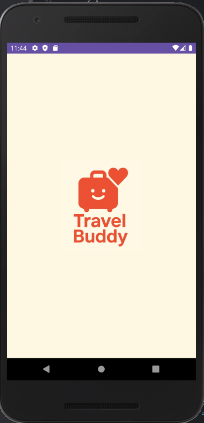
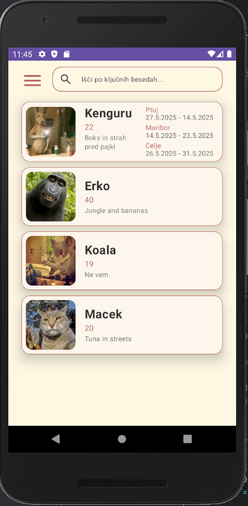
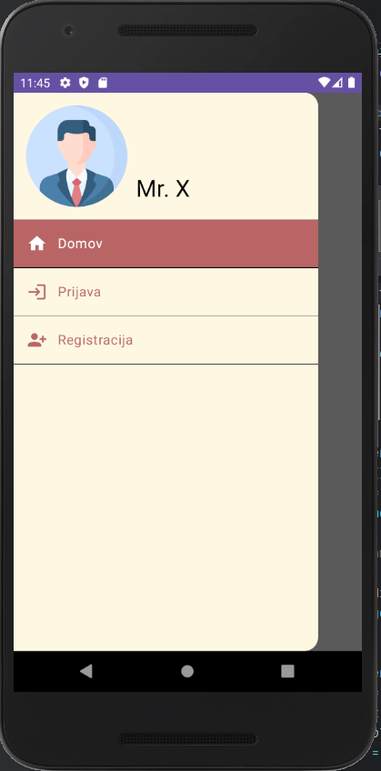
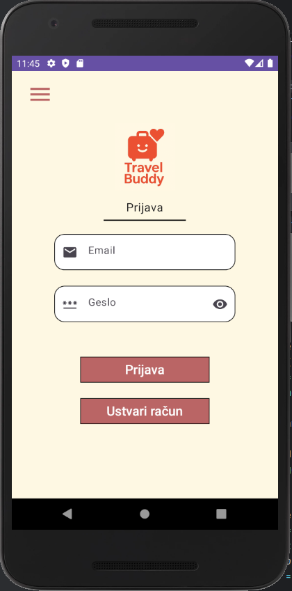
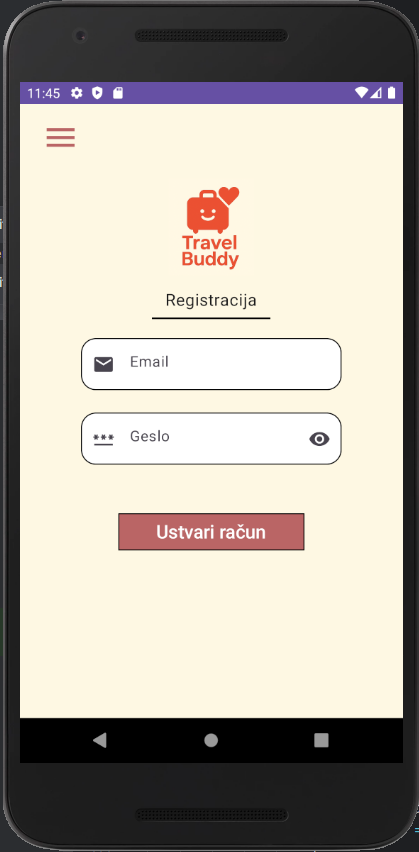
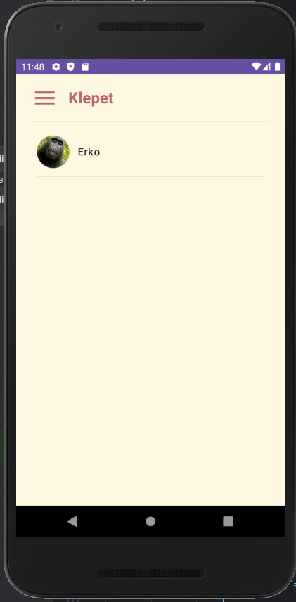
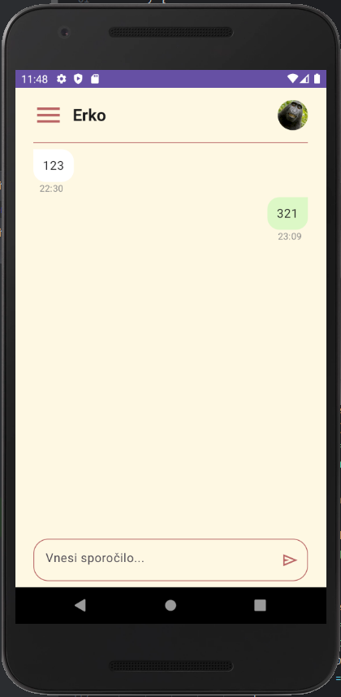

# 😊 Travel Buddy

---

## 🎯 Cilj projekta

Travel Buddy je mobilna aplikacija, ki povezuje potnike in omogoča lažje spoznavanje spremljevalcev za tvoje naslednje dogodivščine! 🌍🧳

---

## 🚀 Ključne funkcionalnosti

- 🔑 **Prijava in registracija** preko Firebase Auth  
- 📋 **Seznam klepetov** z avtomatskim osveževanjem (ChatListViewModel + ChatListView)  
- 💬 **Real-time klepet** z zgodovino sporočil (ChatScreen + ChatViewModel)  
- ⚙️ **Nastavitve klepeta**: urejanje imena, starosti, opisa in destinacij  
- 🗑️ **Brisanje klepetov** z dvojnim klikom + potrdilno okno  

---

## 🖥️ Tehnologije

- **Jezik:** Kotlin  
- **UI:** Jetpack Compose  
- **Backend:** Firebase Firestore & Auth  
- **Gradle:** Kotlin DSL  

---

## 📸 Posnetki zaslona

### Splash Screen

---

### Seznam klepetov

---

### Meni (Guest)

---

### Prijava

---

### Registracija

---

### Profil in nastavitve

---

### Klepet

---

### Nastavitve klepeta

